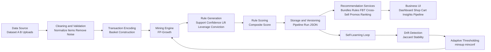

# Pipeline Architecture Diagram

## Loop Notes

1. Iteration 1 learns from baseline transactions.
2. Iteration 2 learns from cumulative datasets.
3. Iteration 3 applies drift simulation and adapts thresholds.
4. Stability verdict reports whether top rules survive across iterations.
